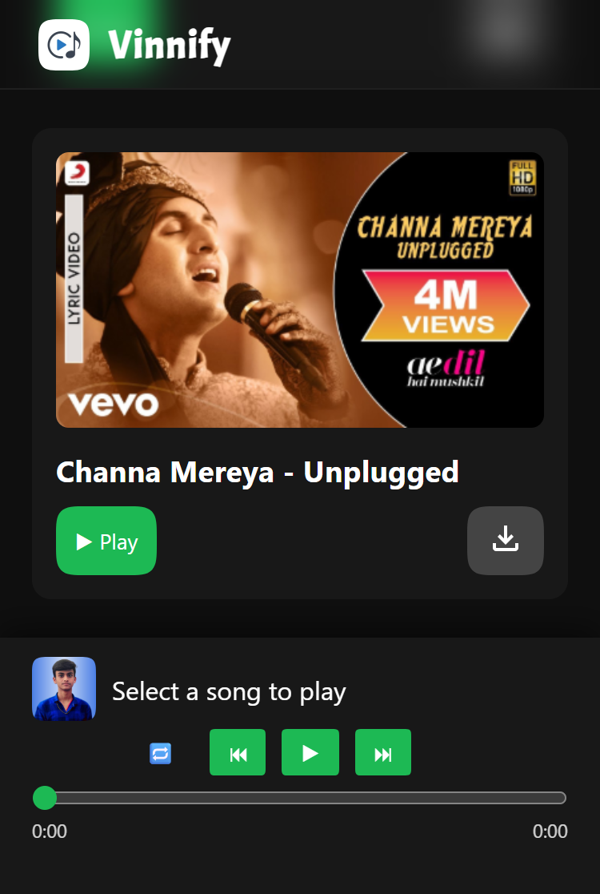

# Vinnify – Music Player

**Vinnify** is an ad-free, modern music player developed by **Vinit Kumar Patwa**.  
It works directly in your browser and supports **offline playback** after the initial load. Enjoy a smooth, fast, and clean audio experience with essential playback controls and a responsive interface.

🌐 **Official App URL:**  
https://vinitkumarpatwa.netlify.app/apps/vinnify/

---

## 📸 Application Preview

  

  

---

## 🚀 Key Features

- 🎵 Smooth music playback  
- ⏯️ Play / Pause control  
- ⏭️ Next / Previous track support  
- 🔁 Loop (repeat current song)  
- 📊 Interactive progress bar (seek control)  
- 📜 Dynamic song list rendering  
- ⚡ Lazy loading (batch loading for performance)  
- 📱 Mini player interface  
- 🟢 Offline support after initial load  
- 🎨 Clean and modern UI design  

---

## 🛠️ Tech Stack

**Frontend:**  
- HTML5  
- CSS3  
- JavaScript (Vanilla JS)  

**Hosting:**  
- Netlify  

---

## ⚙️ How It Works

- Songs are loaded from a JavaScript array  
- Initial batch of songs is loaded for faster startup  
- Additional songs load dynamically as you scroll  
- Audio element handles playback and offline caching  
- UI updates are managed via JavaScript events  

---

## 🎯 Project Objective

This project demonstrates:

- Advanced JavaScript DOM manipulation  
- HTML5 Audio API usage for media handling  
- Performance optimization (lazy loading + offline support)  
- Clean UI/UX design principles  
- Real-world web app development  

It serves as both a **fully functional music player** and a **portfolio-level project**.

---

## 🔒 Performance & Optimization

Vinnify is designed to be lightweight, efficient, and user-friendly:

- Minimal resource usage  
- Optimized loading strategy  
- Smooth interaction handling  
- Fast rendering on modern browsers  
- Offline playback for uninterrupted music  

---

## 👨‍💻 Developer

**Vinit Kumar Patwa**  
Passionate Coder & UI Design Enthusiast  
Nalanda, Bihar, India  

🌐 Official Website:  
https://vinitkumarpatwa.netlify.app/

---

## 📌 Version Information

Current Version: 1.0  
Status: Stable Release  
Platform: Web Application  

---

## ⭐ Support

If you like this project, consider starring the repository ⭐
